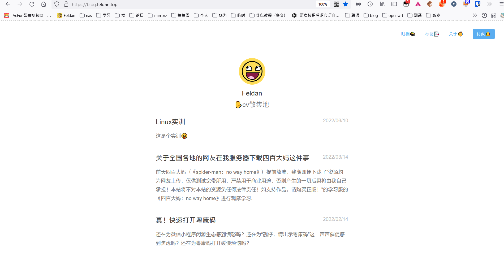

# 实验步骤和技术要点
## 项目一 Linux文件和目录操作   

1. 登录进入系统, 修改个人密码. 
```console
feldan@FeldanBook:~$ passwd feldan
Changing password for feldan.
(current) UNIX password:
Enter new UNIX password:
Retype new UNIX password:
passwd: password updated successfully
```
2. 使用简单命令 date, cal, who, echo, clear 等, 了解 linux 命令格式. 
```console
feldan@FeldanBook:~$ date
Thu Jun  9 14:58:07 CST 2022
feldan@FeldanBook:~$ cal    
     June 2022        
Su Mo Tu We Th Fr Sa  
          1  2  3  4  
 5  6  7  8  9 10 11  
12 13 14 15 16 17 18  
19 20 21 22 23 24 25  
26 27 28 29 30        

feldan@FeldanBook:~$ who
nas      pts/0        2022-06-09 14:56 (27.37.72.96)
feldan@FeldanBook:~$ echo 'hi'
hi
...
```
3. 浏览文件系统. 
- 运行 pwd 命令, 确定当前工作目录.
```console
feldan@FeldanBook:~$ pwd
/home/feldan
```
- 运行 ls-l 命令, 理解各字段含义. 
```console
feldan@FeldanBook:/mnt/c/作业$ ls -l
total 104
-rwxrwxrwx 1 feldan feldan 103053 Apr 27 11:02 2022年第34期入党积 
极分子结业考试试题（改）.doc
drwxrwxrwx 1 feldan feldan   4096 Nov 12  2021 大三上
drwxrwxrwx 1 feldan feldan   4096 Dec 24  2020 大二上
```
- 运行 ls-ai 命令, 理解各字段含义.
```console
feldan@FeldanBook:/mnt/c/作业$ ls -ai
1688849860375430 .
1407374883553285 ..
6192449487769870 2022年第34期入党积极分子结业考试试题（改）.doc   
5348024558189099 大三上
3377699720642279 大二上
```   
- 使用 cd 命令, 将工作目录改到根（/）上.  
```console
feldan@FeldanBook:/mnt/c/作业$ cd /
feldan@FeldanBook:/$ 
``` 
- 直接使用命令 cd, 用 pwd 验证回到哪个目录.  
```console
feldan@FeldanBook:/$ cd 
feldan@FeldanBook:~$ pwd
/home/feldan
````
- 用 mkdir 建立一个子目录 subdir.
```console
feldan@FeldanBook:/$ cd 
feldan@FeldanBook:~$ pwd
/home/feldan
```
- 将工作目录改到 subdir.
```console
feldan@FeldanBook:~$ cd subdir/
feldan@FeldanBook:~/subdir$ 
```` 
1. 文件操作.  
- 验证当前工作目录在 subdir. 
```console
feldan@FeldanBook:~/subdir$ pwd
/home/feldan/subdir
```
- 运行 date>file1, 然后运行 cat file1, 看信息？ 
```console
feldan@FeldanBook:~/subdir$ date>file1
feldan@FeldanBook:~/subdir$ ls
file1
feldan@FeldanBook:~/subdir$ cat file1 
Thu Jun  9 15:18:56 CST 2022
````
- 运行 cat subdir, 会有什么结果？为什么？
```console
feldan@FeldanBook:~/subdir$ cat subdir
cat: subdir: No such file or directory
feldan@FeldanBook:~/subdir$ cd ..
feldan@FeldanBook:~$ cat subdir/
cat: subdir/: Is a directory
```
`无法访问目录本身`而且`cat无法读取目录`   
- 利用 man 命令显示 date 命令的使用说明. 
```console
feldan@FeldanBook:~$ cat subdir/
DATE(1)                             User Commands                             DATE(1)

NAME
       date - print or set the system date and time

SYNOPSIS
       date [OPTION]... [+FORMAT]
       date [-u|--utc|--universal] [MMDDhhmm[[CC]YY][.ss]]
 Manual page date(1) line 1 (press h for help or q to quit)
```
- 运行 man date >>file1, 看到什么？ 运行 cat file1, 看到什么？
```console
feldan@FeldanBook:~/subdir$ man date >>file1
feldan@FeldanBook:~/subdir$ cat file1 
Thu Jun  9 15:18:56 CST 2022
DATE(1)                             User Commands                             DATE(1)   

NAME
       date - print or set the system date and time

SYNOPSIS
       date [OPTION]... [+FORMAT]
       date [-u|--utc|--universal] [MMDDhhmm[[CC]YY][.ss]]
...
```
- 利用 ls-l file1, 了解链接计数是多少？ 运行 ln file1 ../fa, 再运行 ls-l file1, 链接计数有无变化？用 cat 命令显示 fa 文件内容.
```console
feldan@FeldanBook:~/subdir$ ls -l
total 8
-rw-r--r-- 1 feldan feldan 6410 Jun  9 15:24 file1
```
`当前链接计数为1`
```console
feldan@FeldanBook:~/subdir$ ls -l
total 8
-rw-r--r-- 2 feldan feldan 6410 Jun  9 15:24 file1
```
`当前链接计数为2`
```console
feldan@FeldanBook:~/subdir$ cat ../fa
Thu Jun  9 15:18:56 CST 2022
DATE(1)                             User Commands                             DATE(1)   

NAME
       date - print or set the system date and time

SYNOPSIS
       date [OPTION]... [+FORMAT]
       date [-u|--utc|--universal] [MMDDhhmm[[CC]YY][.ss]]
...
```
- 显示 file1 的前 10 行和后 10 行.
```console
feldan@FeldanBook:~/subdir$ head -n 10 file1 
Thu Jun  9 15:18:56 CST 2022
DATE(1)                             User Commands                             DATE(1)   

NAME
       date - print or set the system date and time

SYNOPSIS
       date [OPTION]... [+FORMAT]
       date [-u|--utc|--universal] [MMDDhhmm[[CC]YY][.ss]]

feldan@FeldanBook:~/subdir$ ta
tabcal.exe      takeown.exe     tapisrv.dll     taskbarcpl.dll  taskschd.dll
tabs            tapi3.dll       tapiui.dll      taskcomp.dll    taskschd.msc
tabulate        tapi32.dll      tar             taskhostw.exe   taskset
tac             tapilua.dll     tar.exe         taskkill.exe
tail            tapiperf.dll    tarcat          tasklist.exe
feldan@FeldanBook:~/subdir$ ta
tabcal.exe      takeown.exe     tapisrv.dll     taskbarcpl.dll  taskschd.dll
tabs            tapi3.dll       tapiui.dll      taskcomp.dll    taskschd.msc
tabulate        tapi32.dll      tar             taskhostw.exe   taskset
tac             tapilua.dll     tar.exe         taskkill.exe
tail            tapiperf.dll    tarcat          tasklist.exe
feldan@FeldanBook:~/subdir$ tail -n 10 file1 
       Copyright © 2017 Free Software Foundation, Inc.  License GPLv3+: GNU GPL  ver‐
       sion 3 or later <http://gnu.org/licenses/gpl.html>.
       This  is  free software: you are free to change and redistribute it.  There is   
       NO WARRANTY, to the extent permitted by law.

SEE ALSO
       Full documentation at: <http://www.gnu.org/software/coreutils/date>
       or available locally via: info '(coreutils) date invocation'

GNU coreutils 8.28                   January 2018                             DATE(1)   
feldan@FeldanBook:~/subdir$
```
- 运行 cp file1 file2, 然后 ls-l, 看到什么？ 运行 mv file2 file3, 然后 ls -l, 看到什么？ 运行 cat f*, 结果怎样?
```console
feldan@FeldanBook:~/subdir$ ls -l
total 16
-rw-r--r-- 2 feldan feldan 6410 Jun  9 15:24 file1
-rw-r--r-- 1 feldan feldan 6410 Jun  9 15:34 file2
feldan@FeldanBook:~/subdir$  mv file2 file3
feldan@FeldanBook:~/subdir$ ls -l
total 16
-rw-r--r-- 2 feldan feldan 6410 Jun  9 15:24 file1
-rw-r--r-- 1 feldan feldan 6410 Jun  9 15:34 file3
feldan@FeldanBook:~/subdir$ cat f* # `显示file1和file3的内容`
Thu Jun  9 15:18:56 CST 2022
DATE(1)                             User Commands                             DATE(1)   

NAME
       date - print or set the system date and time

SYNOPSIS
       date [OPTION]... [+FORMAT]
...
```

- 运行 rm file3, 然后 ls-l, 结果如何？ 
```console
feldan@FeldanBook:~/subdir$ rm file3
feldan@FeldanBook:~/subdir$ ls -l
total 8
-rw-r--r-- 2 feldan feldan 6410 Jun  9 15:24 file1
```
`file3被删除`
- 在/etc/passwd 文件中查找包含你注册名的行. 
```console
feldan@FeldanBook:~/subdir$ sudo cat  /etc/passwd |grep feldan
feldan:x:1000:1000:,,,:/home/feldan:/bin/bash
```
- 用两种方式改变 file1 的权限. 
>方法1 chown 更改文件所属用户或者组  

>方法2 chmod 更改文件读写执行权限
- 统计 file1 文件的行数、字数. 

```console
feldan@FeldanBook:~/subdir$ wc -l file1 
204 file1
feldan@FeldanBook:~/subdir$ wc -w file1 
813 file1
```
- 运行 man ls|more, 显示结果是什么？ 
```console
feldan@FeldanBook:~/subdir$ man ls|more
LS(1)                               User Commands                               LS(1)

NAME
       ls - list directory contents

SYNOPSIS
       ls [OPTION]... [FILE]...
...
```
- 运行 cat file1|head -20|tee file5, 结果如何？ 
```console
feldan@FeldanBook:~/subdir$ cat file1|head -20|tee file5
Thu Jun  9 15:18:56 CST 2022
DATE(1)                             User Commands                             DATE(1)   

NAME
       date - print or set the system date and time

SYNOPSIS
       date [OPTION]... [+FORMAT]
       date [-u|--utc|--universal] [MMDDhhmm[[CC]YY][.ss]]

DESCRIPTION
       Display the current time in the given FORMAT, or set the system date.

       Mandatory arguments to long options are mandatory for short options too.

       -d, --date=STRING
              display time described by STRING, not 'now'

       --debug
              annotate the parsed date, and warn about questionable usage to stderr    
```
- 运行 cat file5|wc, 结果如何？ 
```console
feldan@FeldanBook:~/subdir$  cat file5|wc
     20      74     631
``` 

1. 链接文件   
- 用 mkdir 递归新建目录/home/my/mydoc
```console
feldan@FeldanBook:~/subdir$ sudo mkdir -p /home/my/mydoc
feldan@FeldanBook:~/subdir$ tree /home
/home     
├── feldan
│   ├── fa
│   └── subdir
│       ├── file1
│       └── file5
└── my
    └── mydoc

4 directories, 3 files
```
- 用 rmidr 递归删除目录/home/my/mydoc
```console
feldan@FeldanBook:~/subdir$ sudo rmdir /home/my/mydoc
feldan@FeldanBook:~/subdir$ tree /home/
/home/
├── feldan
│   ├── fa
│   └── subdir
│       ├── file1
│       └── file5
└── my

3 directories, 3 files
```
- 在/root 目录下新建目录 my
- feldan@FeldanBook:~$ su
```console
Password:
root@FeldanBook:~# mkdir my
root@FeldanBook:~# ls
my
```

- 对/root/my 创建符号链接（思考：是否能对/root/my 创建硬链接）
```console
root@FeldanBook:~# ln -s my my1
root@FeldanBook:~# ls
my  my1
root@FeldanBook:~# cd my1
root@FeldanBook:~/my1# ls
root@FeldanBook:~/my1# pwd
/root/my1
```
- 在 my 中创建普通文件 myfile.txt
```console
root@FeldanBook:~/my# touch myfile.txt
root@FeldanBook:~/my# ls
myfile.txt
```
- 为 myfile.txt 创建硬链接和ls.
```console
root@FeldanBook:~/my# ln myfile.txt myfile1.txt
root@FeldanBook:~/my# ln -s myfile.txt myfile2.txt
root@FeldanBook:~/my# ls
myfile.txt  myfile1.txt  myfile2.txt
```
- 删除 myfile.txt 查看其硬链接和符号链接的状态.（是否还能正常打开）
```console
root@FeldanBook:~/my# rm myfile.txt 
root@FeldanBook:~/my# cat myfile1.txt 
root@FeldanBook:~/my# cat myfile2.txt 
cat: myfile2.txt: No such file or directory
```

## 项目二 Linux 系统用户管理策略分析
1. 创建 1 个组群账户，取名 stugrp，设置 GID=1010；
```console
root@FeldanBook:~# groupadd -g 1010 stugrp

stugrp: x:1010:
```
2. 批量创建 50 个用户 stu001，stu002,...，stu050，设置其 UID=1010，1011，1012，...，1059。并设置 GID=1010，设置用户主目录为/home/stu001、... 、/home/stu050，设置 shell 为/bin/bas
```console
root@FeldanBook:~# sh adduser.sh
groupadd: "stugrp"组已存在
User and password generation succeeded
succeede
root@FeldanBook:~# tail -50 /etc/passwd
stu01:x:1010:1010:stu01:/home/stu01:/bin/bash
stu02:x:1010:1010:stu02:/home/stu02:/bin/bash
stu03:x:1010:1010:stu03:/home/stu03:/bin/bash
stu04:x:1010:1010:stu04:/home/stu04:/bin/bash
stu05:x:1010:1010:stu05:/home/stu05:/bin/bash
stu06:x:1010:1010:stu06:/home/stu06:/bin/bash
stu07:x:1010:1010:stu07:/home/stu07:/bin/bash
stu08:x:1010:1010:stu08:/home/stu08:/bin/bash
stu09:x:1010:1010:stu09:/home/stu09:/bin/bash
stu10:x:1010:1010:stu10:/home/stu10:/bin/bash
stu11:x:1010:1010:stu11:/home/stu11:/bin/bash
stu12:x:1010:1010:stu12:/home/stu12:/bin/bash
...
```
```bash
#!/bin/bash
# file        :item2_adduser.sh
# Author      :feldan
# url https://blog.feldan.top
# Date        :2022/06/09 16:24:57
uid=1009
gid=1010
groupadd -g $gid stugrp
for((i=1;i<51;i++)); 
do
if ["$i" -lt 10]
then
uname=stu0$i
else
uname=stu$1
fi
    let "uid=uid+1"
    echo $uname:x:$uid:$gid:$uname:/home/$uname:/bin/bash>>user.txt
    echo $uname:stu123>>userpasswd.txt
done
echo "User and password generation succeeded"
newusers < user.txt #读取创建
pwunconv #取消加密
chpasswd < userpasswd.txt #读取创建密码
pwconv #恢复加密
echo "succeede"
```

## 项目三 进程管理  
- 输入 ps 命令，分别就不带选项和带选项-a、-e、-f、u、x 分析输出结果，
明确各字段的含义
```console
feldan@FeldanBook:~$ ps
  PID TTY          TIME CMD
   60 tty3     00:00:00 bash
   85 tty3     00:00:00 ps
feldan@FeldanBook:~$ ps -a
  PID TTY          TIME CMD
    9 tty2     00:00:00 bash
   10 tty1     00:00:00 bash
   60 tty3     00:00:00 bash
   86 tty3     00:00:00 ps
feldan@FeldanBook:~$ ps -e
  PID TTY          TIME CMD
    1 ?        00:00:00 init
    7 tty1     00:00:00 init
    8 tty2     00:00:00 init
    9 tty2     00:00:00 bash
   10 tty1     00:00:00 bash
   59 tty3     00:00:00 init
   60 tty3     00:00:00 bash
   87 tty3     00:00:00 ps
feldan@FeldanBook:~$ ps -f
UID        PID  PPID  C STIME TTY          TIME CMD
feldan      60    59  1 08:45 tty3     00:00:00 -bash
feldan      88    60  0 08:46 tty3     00:00:00 ps -f
feldan@FeldanBook:~$ ps -u
USER       PID %CPU %MEM    VSZ   RSS TTY      STAT START   TIME COMMAND
feldan       9  0.0  0.0  16792  3476 tty2     S    08:30   0:00 -bash
feldan      10  0.0  0.0  16792  3476 tty1     S    08:30   0:00 -bash
feldan      60  1.5  0.0  16796  3484 tty3     S    08:45   0:00 -bash
feldan      89  0.0  0.0  17392  1952 tty3     R    08:46   0:00 ps -u
feldan@FeldanBook:~$ ps -x
  PID TTY      STAT   TIME COMMAND
    9 tty2     S      0:00 -bash
   10 tty1     S      0:00 -bash
   60 tty3     S      0:00 -bash
   90 tty3     R      0:00 ps -x
```
- 输入 ps –ef 命令从后向前找出各自的父进程，直至 1 号进程，画出相关进
程的族系关系图
```console
feldan@FeldanBook:~$ ps -ef
UID        PID  PPID  C STIME TTY          TIME CMD
root         1     0  0 08:30 ?        00:00:00 /init
root         7     1  0 08:30 tty1     00:00:00 /init
root         8     1  0 08:30 tty2     00:00:00 /init
feldan       9     8  0 08:30 tty2     00:00:00 -bash
feldan      10     7  0 08:30 tty1     00:00:00 -bash
root        59     1  0 08:45 tty3     00:00:00 /init
feldan      60    59  0 08:45 tty3     00:00:00 -bash
feldan      91    60  0 08:46 tty3     00:00:00 ps -ef
```
- 编写一个简单的 shell 程序，其文件名为 myfile.sh。
```bash
cat myfile.sh
echo 1
echo 2
echo 3
sleep 20
echo 4
echo 5
```
bash 运行脚本出现什么情况？
```console
DUST-DabianPractice/Linux课程设计$ ./myfile.sh 
cat myfile.sh
echo 1
echo 2
echo 3
sleep 20
echo 4
echo 51
2
3

```
如果在末尾加一个&，出现什么情况。
```console
feldan@FeldanBook:/mnt/c/Users/Feldan/OneDrive - gdust.edu.cn/个
DUST-DabianPractice/Linux课程设计$ ./myfile.sh &
[1] 104
feldan@FeldanBook:/mnt/c/Users/Feldan/OneDrive - gdust.edu.cn/个
DUST-DabianPractice/Linux课程设计$ cat myfile.sh
echo 1
echo 2
echo 3
sleep 20
echo 4
echo 51
2
3

```
用 ps 查看。
```console
DUST-DabianPractice/Linux课程设计$ ps
  PID TTY          TIME CMD
   10 tty1     00:00:00 bash
  104 tty1     00:00:00 bash
  106 tty1     00:00:00 sleep
  107 tty1     00:00:00 ps
```
- 执行命令 sleep 60;who |grep ‘root’，观察系统有何反应。
```console
feldan@FeldanBook:/mnt/c/Users/Feldan/OneDrive - gdust.edu.cn/个
DUST-DabianPractice/Linux课程设计$ sleep 60;who |grep ‘r
oot’
# 60秒不能操作
```
- 用 top 命令查看当前系统的状态，并识别各进程的有关栏目
```console
top - 08:53:48 up 23 min,  0 users,  load average: 0.52, 0.58, 0.59
Tasks:   8 total,   1 running,   7 sleeping,   0 stopped,   0 zombie
%Cpu(s):  3.1 us,  2.3 sy,  0.0 ni, 94.1 id,  0.0 wa,  0.5 hi,  0.0 si,  0.0 st
KiB Mem :  6199272 total,  1154944 free,  4814976 used,   229352 buff/cache
KiB Swap: 18874368 total, 18706144 free,   168224 used.  1250564 avail Mem

  PID USER      PR  NI    VIRT    RES    SHR S  %CPU %MEM     TIME+ COMMAND
    1 root      20   0    8940    328    284 S   0.0  0.0   0:00.31 init
    7 root      20   0    8940    224    192 S   0.0  0.0   0:00.01 init
    8 root      20   0    8940    224    192 S   0.0  0.0   0:00.00 init
    9 feldan    20   0   16792   3476   2096 S   0.0  0.1   0:00.27 bash
   10 feldan    20   0   17056   3892   3588 S   0.0  0.1   0:00.47 bash
   59 root      20   0    8940    224    180 S   0.0  0.0   0:00.01 init
   60 feldan    20   0   16796   3484   3372 S   0.0  0.1   0:00.39 bash
  112 feldan    20   0   17640   2104   1552 R   0.0  0.0   0:00.01 top

```
- 用 ps 查看系统当前进程，并查看系统当前有没有 init 进程
```console
feldan@FeldanBook:/mnt/c/Users/Feldan/OneDrive - gdust.edu.cn/个danBook:/mnt/c/UsFeldan/人学习
/GDUST-DabianPractice$ ps
  PID TTY          TIME CMD
    9 tty2     00:00:00 bash
  113 tty2     00:00:00 ps
```
- 输入“cat <回车>”，按 CTRL+Z 键，出现什么情况？输入 fg 命令出现什么情况，按 CTRL+C 键，出现什么情况？
```console
/GDUST-DabianPractice$ cat
^Z
[1]+  Stopped                 cat
feldan@FeldanBook:/mnt/c/Users/Feldan/OneDrive - gdust.edu.cn/个 
人学习
/GDUST-DabianPractice$ fg
cat
/GDUST-DabianPractice$ fg
cat
^C
feldan@FeldanBook:/mnt/c/Users/Feldan/OneDrive - gdust.edu.cn/个 
人学习
/GDUST-DabianPractice$ 
```

- 在后台启动一个任务（例如 vi test.txt&）然后用 jobs 命令列出任务，并用
fg 命令将任务切换到前台运行。
```console
feldan@FeldanBook:/mnt/c/Users/Feldan/Onegdust.edu.cn/个人学习/GDUST-DabianPractice/Linux课程设计$ vim myfile.sh&
[1] 124
feldan@FeldanBook:/mnt/c/Users/Feldan/Onegdust.edu.cn/个人学习/GDUST-DabianPractice/Linux课程设计$ jobs
[1]+  Stopped                 vim myfile.sh
feldan@FeldanBook:/mnt/c/Users/Feldan/Onegdust.edu.cn/个人学习/GDUST-DabianPractice/Linux课程设计$ fg 1
vim myfile.sh
```
- 在 2019 年 12 月 12 日 0 点 0 分（注：具体时间可根据实际实验实践修改）
查看系统中有哪些用户登录，把结果保存到 yh.txt 中，并将执行的结果以 E-mail
传回。
```console
feldan@FeldanBook:~$at -m 00:33 2022-6-09
at>who>yh.txt
at><EOT>
job 3 at Fri june 10 00:33:00 2022
```
- 先建立 2 个文件 mydoc1.txt 和 mydoc2.txt，并分别任意输入一些内容。利用 batch 命令显示 mydoc1.txt 与 mydoc2.txt 两个文件的内容。
```console
feldan@FeldanBook:~$ vim mydoc1.txt
feldan@FeldanBook:~$ vim mydoc2.txt
feldan@FeldanBook:~$ batch
````
- 自己新建并编辑一个 crontset 文件，用 crontab 命令实现每小时的 30 分钟
自动检查登录系统的用户并保存到 mysyslog 日志文件中。
a）建立文件 crontset,按 crontab 文件规则输入以下内容:
b）用命令 crontab 调度：
```console
[nas@nas-manjaro ~]$ crontab -e
no crontab for nas - using an empty one
crontab: installing new crontab
[nas@nas-manjaro ~]$ crontab -l
*/30 * * * * /home/nas/crontest.sh>/home/nas/log.txt
```

- 运行 ps 命令，查看进程状态，执行相关命令。
```console
[nas@nas-manjaro ~]$ ps
    PID TTY          TIME CMD
 357713 pts/2    00:00:00 bash
 357817 pts/2    00:00:00 ps
```
- 用 kill -l 列出信号。
```console
[nas@nas-manjaro ~]$ kill -l
 1) SIGHUP       2) SIGINT       3) SIGQUIT      4) SIGILL       5) SIGTRAP
 6) SIGABRT      7) SIGBUS       8) SIGFPE       9) SIGKILL     10) SIGUSR1
11) SIGSEGV     12) SIGUSR2     13) SIGPIPE     14) SIGALRM     15) SIGTERM
16) SIGSTKFLT   17) SIGCHLD     18) SIGCONT     19) SIGSTOP     20) SIGTSTP
21) SIGTTIN     22) SIGTTOU     23) SIGURG      24) SIGXCPU     25) SIGXFSZ
26) SIGVTALRM   27) SIGPROF     28) SIGWINCH    29) SIGIO       30) SIGPWR
31) SIGSYS      34) SIGRTMIN    35) SIGRTMIN+1  36) SIGRTMIN+2  37) SIGRTMIN+3
38) SIGRTMIN+4  39) SIGRTMIN+5  40) SIGRTMIN+6  41) SIGRTMIN+7  42) SIGRTMIN+8
43) SIGRTMIN+9  44) SIGRTMIN+10 45) SIGRTMIN+11 46) SIGRTMIN+12 47) SIGRTMIN+13
48) SIGRTMIN+14 49) SIGRTMIN+15 50) SIGRTMAX-14 51) SIGRTMAX-13 52) SIGRTMAX-12
53) SIGRTMAX-11 54) SIGRTMAX-10 55) SIGRTMAX-9  56) SIGRTMAX-8  57) SIGRTMAX-7
58) SIGRTMAX-6  59) SIGRTMAX-5  60) SIGRTMAX-4  61) SIGRTMAX-3  62) SIGRTMAX-2
63) SIGRTMAX-1  64) SIGRTMAX
```
- 运行 find / -name foxy.jpg&，然后用 ps 命令查看进程号，并用 kill 命
令终止进程，在用 ps 查看进程是否已经删除。
```console


feldan@FeldanBook:~$ ps
  PID TTY          TIME CMD
   60 tty3     00:00:00 bash
  138 tty3     00:00:25 find
  140 tty3     00:00:00 ps
feldan@FeldanBook:~$ ps -ef|grep find
feldan     138    60 71 09:45 tty3     00:01:01 find / -name dd.jpg
feldan     142    60  0 09:47 tty3     00:00:00 grep --color=auto find
feldan@FeldanBook:~$ kill -9 138
feldan@FeldanBook:~$ ps -ef|grep find
feldan     144    60  0 09:47 tty3     00:00:00 grep --color=auto find
[1]+  Killed                  find / -name dd.jpg
```
## 项目四 shell 编程综合设计
编写一个显示菜单的 shell 程序，利用函数实现简单的菜单功能，n 的值由键
盘输入：
```
===========================================
** （1）计算 1 到 n 的奇数之和； **
** （2）计算 1 到 n 的阶乘； **
** （3）计算 1 到 n 的所有素数； **
** （4）退出程序。 ** 
========================================== 
Please enter function select and number:
```
```bash
#/bin/bash
function method1(){
    sum=0
    for((i=1;i<=$y;i++,i++))
    do
        let "sum=sum+i"
    done
    echo "1 add to n sum is $sum"
}
function method2(){
    sum1=1
    sum2=0
    for((i=1;i<=$y;i++))
    do
        let "sum1=sum1*i"
    done
    echo "1 to n allsum is $sum1"
}
function method3(){
for((i=2;i<$y;i++))
    do
        isprime
        if [ "$?" -eq 0 ]
            then echo -n "$i "
        fi
    done
    echo
}
function isprime(){
    if((i==2))
        then return 0
    elif((i%2==0))
        then
    return 1   
    fi
        bond=$((i/2));flag=0
    for((k=3;k<=bond;k=k+2))
    do
        if((i%k==0));then
            flag=1
            break
        fi
    done
return $flag
}
#主函数 输入x y  如果x为4退出循环
x=0
for((;$x!=4;))
do
    echo ===========================================
    echo "**    （1）计算1到n的奇数之和；       **"
    echo "**    （2）计算1到n的阶乘；           **"
    echo "**    （3）计算1到n的所有素数；       **"
    echo "**    （4）退出程序。                 **"
    echo ==========================================
    echo -n Please enter function select and number:
    read x y
    case $x in
        1) method1 ;;
        2) method2 ;;
        3) method3 ;;
    esac
done
```
## 实训五 Apache 服务器配置与个人 Web 站点配置
1. Apache配置
```console
root@VM-8-12-debian:/usr/local/nginx/html/www/blog# cat /etc/nginx/conf.d/
blog.conf         chi-s-m.conf      gdust.conf        ssl/              www.conf          
blogschool.conf   chi-s-m.conf.bck  home.conf.bck     webdav.conf.bck   
root@VM-8-12-debian:/usr/local/nginx/html/www/blog# cat /etc/nginx/conf.d/blog.conf 
server {
        listen 80;
        server_name blog.feldan.top;
        rewrite ^(.*) https://${server_name}$1 permanent;

 }
server{
        listen 443 ssl;
 
        server_name blog.feldan.top;

        ssl_certificate /etc/nginx/conf.d/ssl/blog.feldan.top/blog.feldan.top.pem;
        ssl_certificate_key /etc/nginx/conf.d/ssl/blog.feldan.top/blog.feldan.top.key;

        location /{
                root /usr/local/nginx/html/www/blog/public;
                index index.html;
        }
 }

root@VM-8-12-debian:/usr/local/nginx/html/www/blog# 
```
2. 实训主页已上传至云服务器

